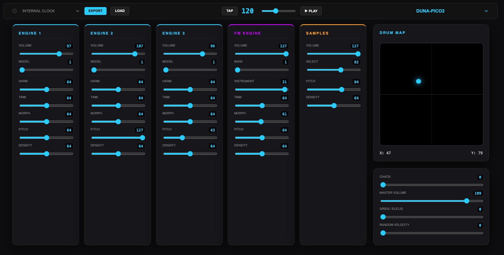

# DUNA

Raspberry Pi PICO2 drum synthesizer based on Mutable Instruments **Plaits** (Macro-Oscillator)  
and **Grids** (Topographic Drum Sequencer).

This is first test version with 3 drum engines, 1 FM engine bank with 32 instruments and 1 sample loaded. More dx7 syx drum banks and samples will be added in future.   

---

## Features

- 4 x Plaits-based drum engines (Engines 1-3 + FM Engine with 32 instrument .syx bank)  
- 1 x Sample-based Percussion Engine  
- Algorithmic Sequencing: Integrated Euclidean and Topographic (Grids) logic  
- High-Resolution UI: Web-based MIDI Dashboard with XY Mapping
- Export / Load presets in webui

---
## Sequencer Overview

- **Engines 0–2** can operate in **Grids** or **Euclidean** mode.
- **FM and Sample engines (3–4)** are **always driven by the Euclidean sequencer**.
  - When **Grids mode (mode 0)** is active, **X/Y has no effect on engines 3–4** and 
    pattern length is fixed to 16 steps.

## X / Y Control

**X** and **Y** form a 2D control space for the algorithmic sequencer.  
Their behavior depends on the active sequencer mode.

### Grids Mode

- **X/Y** navigate a 2D pattern map.
- Movement morphs **hit probability and rhythmic structure**.

### Euclidean Mode

- **X** — loop length *(4, 5, 7, 8, 11, 16, 24, 32)*  
- **Y** — rotation (pattern phase shift)

## Chaos

- **Randomness** introduces controlled instability.
- Adds variation by probabilistically shifting hits.
---

##  Hardware

- **Controller:** RP2350 (Raspberry Pi Pico 2)  
- **I2S DAC:** PCM5102  
  - **Data Pin (DIN):** GPIO 9  
  - **Bit Clock (BCLK):** GPIO 10  
  - **LRCK (Word Select):** GPIO 11 (Standard I2S sequence)  
- **MIDI:** USB-MIDI 
---

## Compilation Settings (Recommended)

- **RP2350 Clock:** 300 MHz (Overclock)  
- **Optimization:** Optimize Even More (-O3)  
- **USB Stack:** Adafruit TinyUSB  

---

## MIDI CC Assignments

| Engine         | CC         | Parameter             |
|----------------|------------|----------------------|
| Global         | 8          | Master Volume        |
| Global         | 17         | Clock Divider        |
| Global         | 21         | XY Pad X             |
| Global         | 22         | XY Pad Y             |
| Global         | 23         | Chaos                |
| Global         | 24         | Grids / Euclid       |
| Global         | 25         | Random Velocity      |
| Engines 1–3    | 30 / 40 / 50 | Harmonics           |
| Engines 1–3    | 31 / 41 / 51 | Timbre              |
| Engines 1–3    | 32 / 42 / 52 | Morph               |
| Engines 1–3    | 33 / 43 / 53 | Decay               |
| Engines 1–3    | 34 / 44 / 54 | Pitch               |
| Engines 1–3    | 35 / 45 / 55 | Density             |
| Engines 1–3    | 36 / 46 / 56 | Volume              |
| Engines 1–3    | 37 / 47 / 57 | Model               |
| FM       | 70         | Instrument          |
| FM      | 71         | Timbre              |
| FM      | 72         | Morph               |
| FM       | 73         | Decay               |
| FM      | 74         | Pitch               |
| FM       | 75         | Density             |
| FM       | 76         | Volume              |
| FM      | 77         | Bank                |
| Sample   | 60         | Volume              |
| Sample  | 61         | Pitch               |
| Sample   | 62         | Density             |
| Sample   | 67         | Select              |

---

## Credits

- **PLAITS & GRIDS original DSP:** Émilie Gillet (Mutable Instruments), MIT license  
- **PLAITS & STMLIB Arduino port:** [arduinoMI](https://github.com/poetaster/arduinoMI), Mark Washeim, MIT license

---

## License

This project is licensed under the **MIT License**.
